  # Ⓜ️MY MOODY : HTP 기반 그림 심리 분석 & AI 챗봇 플랫폼
  ## 📌 프로젝트 개요

  > **MY MOODY**는 HTP(House-Tree-Person) 기반 AI 그림 심리 분석과 개인 맞춤형 GPT 챗봇을 결합한 비대면 정서 지원 플랫폼입니다.

  ## 🎯 주요 특징

  - 🎨 **AI 그림 분석**: YOLOv11 + OpenCV + GPT-4o를 활용한 HTP 그림 자동 분석
  - 🧠 **심리 유형 분류**: BERT 기반 5가지 성격 유형 분류
  - 💬 **맞춤형 챗봇**: 개인 유형에 최적화된 GPT 페르소나 상담
  - 📊 **시각화 대시보드**: 심리 분석 결과 및 상담 기록 통계
  - 🔒 **개인정보 보호**: 익명 처리된 안전한 심리 상담 환경

  ## 🎯 핵심 가치
  - **접근성**: 언제 어디서나 간편한 심리 상담 서비스
  - **개인화**: 5가지 성격 유형별 맞춤형 상담 경험
  - **안전성**: 익명성 보장과 개인정보 보호


  ## 👨‍👨‍👧‍👦 팀 소개 - SKN 12기 6팀

  |                       **김승학**                        |                      **남의헌**                      |                       **이정민**                       |                     **이지복**                      |                      **조성지**                       |
  | :-----------------------------------------------------: | :--------------------------------------------------: | :----------------------------------------------------: | :-------------------------------------------------: | :---------------------------------------------------: |
  |  | 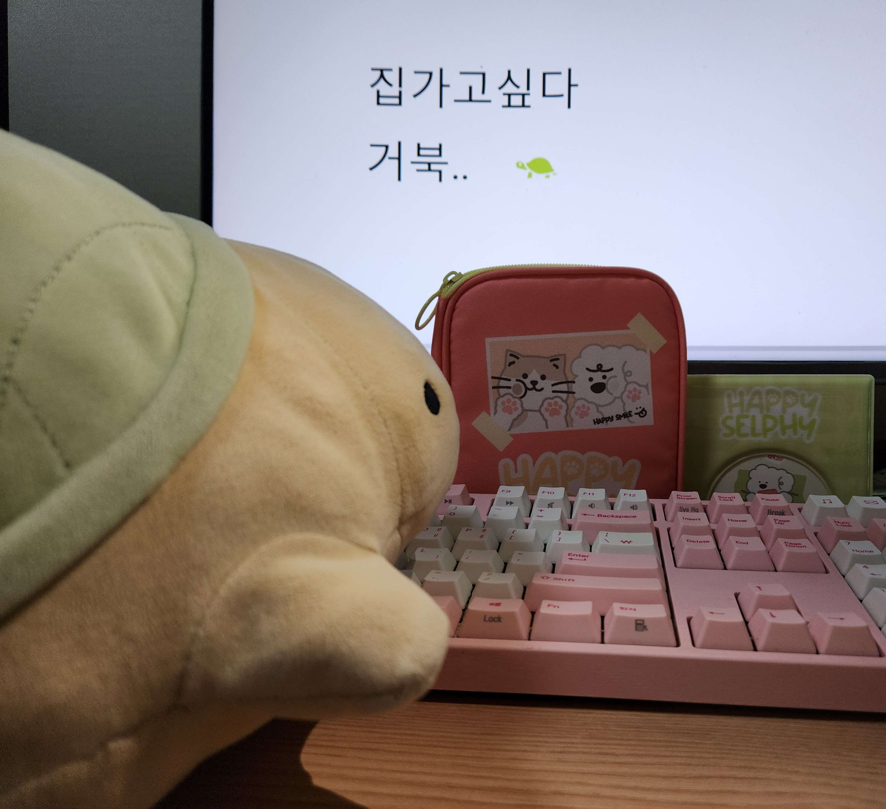 |  |  |  |
  |                  **백엔드** | **데이터 엔지니어** | **PM** | **AI/ML 엔지니어** | **프론트엔드**| 
  **안정형**                      |                     **내면형**                      |                      **관계형**                          |                      **추진형**                      |                      **쾌락형**       |

  ## 📅 WBS (2025년 6월 30일 ~ 8월 21일)
  <p align="center">
    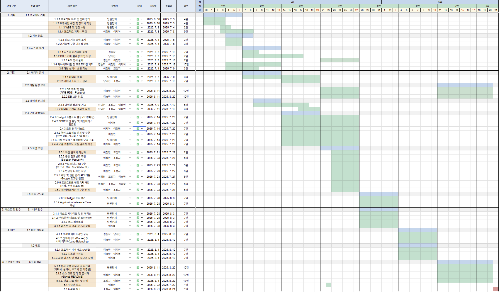
  </p>


  ## 💡 서비스 플로우
  <p align="center">
    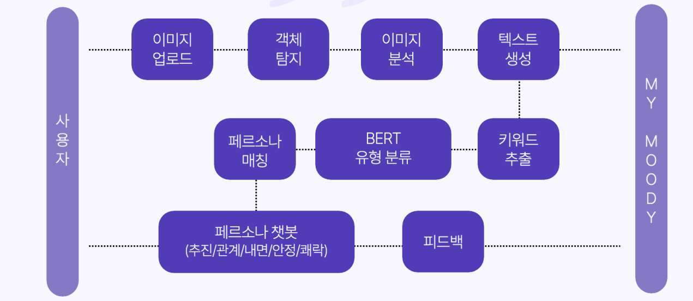
  </p>

  > **이미지 분석 + GPT 해석 + ML 분류 + 유형별 프롬프트** → 개인 맞춤형 상담 경험 제공


  ### 🧠 핵심 기능
  ### 1. 이미지 업로드 → 심리 분석

  - YOLOv11로 집/나무/사람 객체 탐지
  - OpenCV로 시각적 요소 수치화 (크기, 위치, 비율 등)
  - GPT-4o가 그림 의미 해석 문장 생성 (프롬프트 기반 엔지니어링)

  ### 2. 감정 키워드 추출 & 유형 분류

  - 해석문에서 감정 키워드 파싱 → JSON 매핑 테이블로 점수화
  - BERT 기반 분류기로 5가지 유형 중 하나 분류

  ### 3. 페르소나 챗봇 대화 → 심리 상담

  - 유형별 프롬프트 기반 GPT-4o 챗봇 연결
  - 정서 피드백, 공감 대화, 자기 돌봄 전략 제공

  ## 🛠 기술 스택

  | **구분**           | **기술 스택**                                                                                                                                                                                                                                                                                                                  |
  | ------------------ | ---------------------------------------------------------------------------------------------------------------------------------------------------------------------------------------------------------------------------------------------------------------------------------------------------------------------------------- |
  | **Backend**        |                          |
  | **Frontend**       |                                                                                                                 |
  | **AI 모델**        |     |
  | **Infra & DevOps** |        |

  ---
  [](https://python.org)
  [](https://fastapi.tiangolo.com)
  [](https://reactjs.org)
  [](https://docker.com)


  ## 📁 프로젝트 구조

  ```
  SKN12-FINAL-6TEAM/
  ├── 📋 README.md                    # 프로젝트 메인 문서
  ├── 🐳 docker-compose.yml           # 프로덕션 Docker 설정
  ├── 🐳 docker-compose.local.yml     # 로컬 개발 Docker 설정
  │
  ├── 🔧 backend/                     # Python FastAPI 백엔드
  │   ├── app/                        # 메인 애플리케이션
  │   │   ├── api/                    # API 엔드포인트
  │   │   ├── models/                 # 데이터베이스 모델
  │   │   ├── schemas/                # Pydantic 스키마
  │   │   ├── services/               # 비즈니스 로직 
  │   │   └── utils/                  # 유틸리티 함수
  │   │
  │   ├── 🤖 llm/                     # AI/ML 모델 및 분석
  │   │   ├── model/                  # 그림 분석 AI 모델
  │   │   ├── opensearch_modules/     # RAG 및 검색 엔진
  │   │   └── data/                   # 학습 데이터
  │   │       └── md/                 # RAG 문서 (집, 사람, 나무 분석)
  │   │
  │   ├── 🔄 preprocess/              # 데이터 전처리
  │   │   ├── data/                   # 원본 학습 데이터
  │   │   ├── result/                 # 전처리 결과물
  │   │   └── main.py                 # 전처리 메인 스크립트
  │   ├── 📝 prompts/                 # 챗봇 페르소나 프롬프트
  │   │   ├── anjeong_persona.md      # 안정형 페르소나
  │   │   ├── chujin_persona.md       # 추진형 페르소나
  │   │   ├── gwangye_persona.md      # 관계형 페르소나
  │   │   ├── nemyeon_persona.md      # 내면형 페르소나
  │   │   └── querock_persona.md      # 쾌락형 페르소나
  │   └── ⚙️ config files             # 설정 파일들
  │
  ├── 🎨 frontend/                    # React TypeScript 프론트엔드
  │   ├── public/                     # 정적 파일
  │   │   ├── assets/                 # 이미지 리소스
  │   │   │   ├── backgrounds/        # 배경 이미지
  │   │   │   └── persona/            # 페르소나 이미지
  │   │   └── jokes.json              # 농담 데이터
  │   ├── src/
  │   │   ├── components/             # React 컴포넌트
  │   │   │   ├── pages/              # 페이지 컴포넌트
  │   │   │   ├── common/             # 공통 컴포넌트
  │   │   │   └── ui/                 # UI 컴포넌트 
  │   │   ├── services/               # API 서비스 클라이언트
  │   │   ├── hooks/                  # React 커스텀 훅
  │   │   ├── types/                  # TypeScript 타입 정의
  │   │   └── data/                   # 정적 데이터
  │   └── 📦 config files             # 설정 파일들
  └── 📊 assets/                      # 프로젝트 자료
    └── img/team/                   # 팀 관련 이미지
  ```


  ## 🧬 AI 모델 상세

  ### 🎯 객체 탐지 모델 (YOLOv11)
  - **용도**: HTP 그림에서 집, 나무, 사람 객체 자동 탐지
  - **학습 데이터**: 93개 HTP 그림 (공공 데이터)
  - **성능 지표**:
    - Precision: 0.99
    - Recall: 0.97
    - F1 Score: 0.77
  - **모델 크기**: 22MB (.pt 형식)

  ### 🧠 감정 분류 모델 (BERT)
  - **용도**: GPT 해석문에서 감정 키워드 추출 후 5가지 성격 유형 분류
  - **기반 모델**: klue/bert-base
  - **학습 데이터**: 100개 감정 명사 키워드
  - **성능 지표**:
    - Accuracy: 0.97
    - F1 Score: 0.96
    - 각 클래스별 정밀도: 0.94-0.98

  ### 🎭유형별 페르소나 챗봇

  | 이름 | 유형   | 주요 특성               | 챗봇 상담 전략                   |
  | --|------ | ----------------------- | -------------------------------- |
  | 🌱 내면이 | 내면형 | 감정적 민감함, 자기성찰 | 감정 표현 유도, 자기 이해 촉진   |
  | 🧠 안정이 |안정형 | 조화 지향, 불안 회피    | 신뢰 중심 언어, 정서적 안정 제공 |
  | 🤝 햇살이 | 관계형 | 애정 중심, 인정 욕구    | 정서 유대 형성, 자기 돌봄 강조   |
  | 🚀 추진이 | 추진형 | 성취욕, 통제욕          | 목표 중심, 자기 주도성 강화      |
  | ⚡ 쾌락이 | 쾌락형 | 자극 추구, 고통 회피    | 긍정 감정 환기, 창의적 자극 제공 |
  ---

  ## 🗃 데이터베이스 ERD

  <p align="center">
    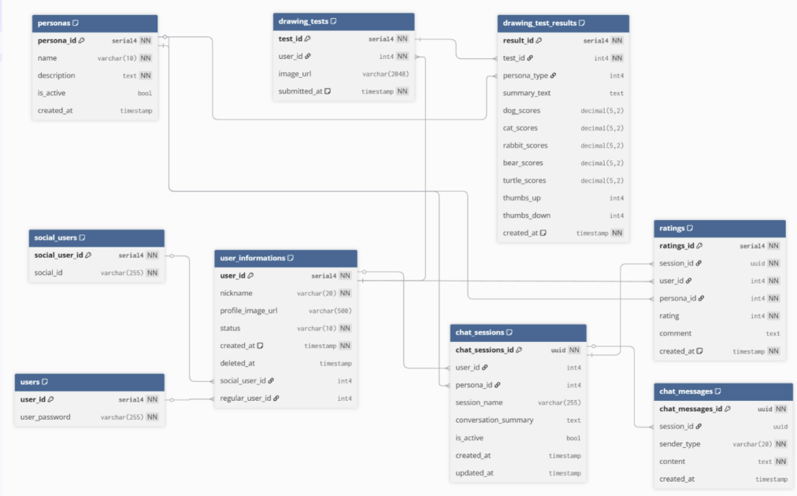
  </p>

  ## ⚙️ 시스템 아키텍처

  <p align="center">
    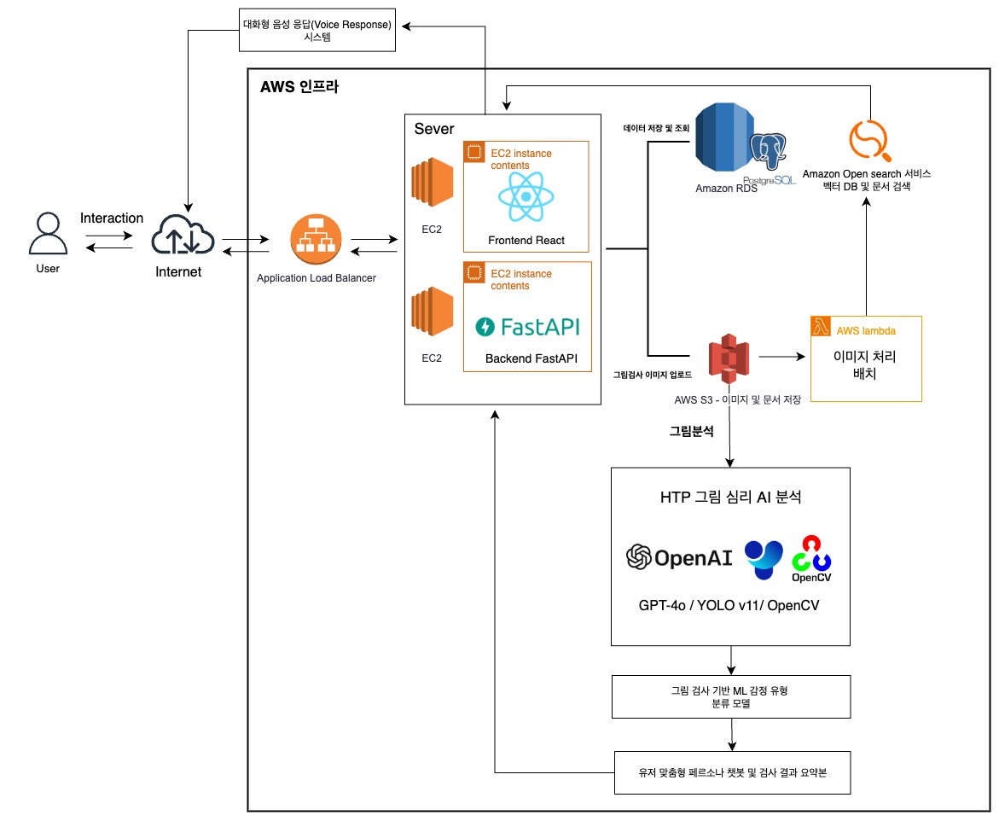
  </p>


  ## 🖥️화면 구성

  <p align="center">
    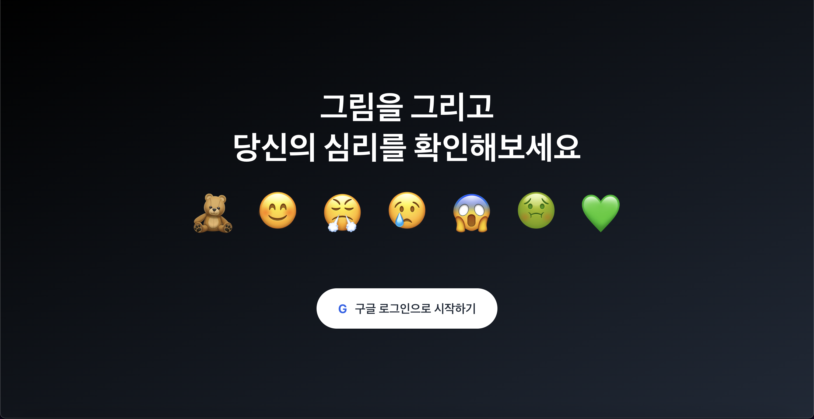
    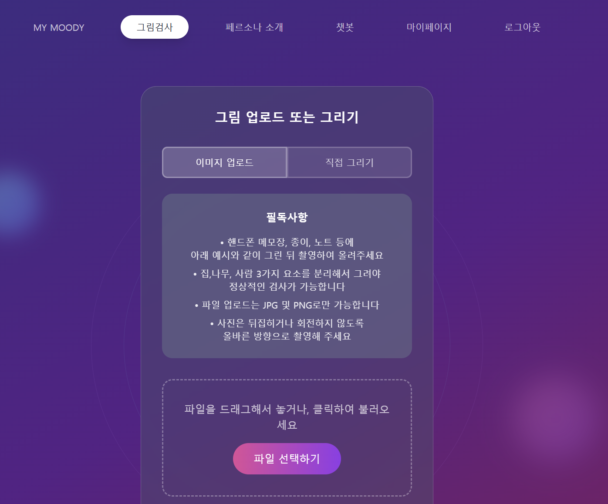<br>
    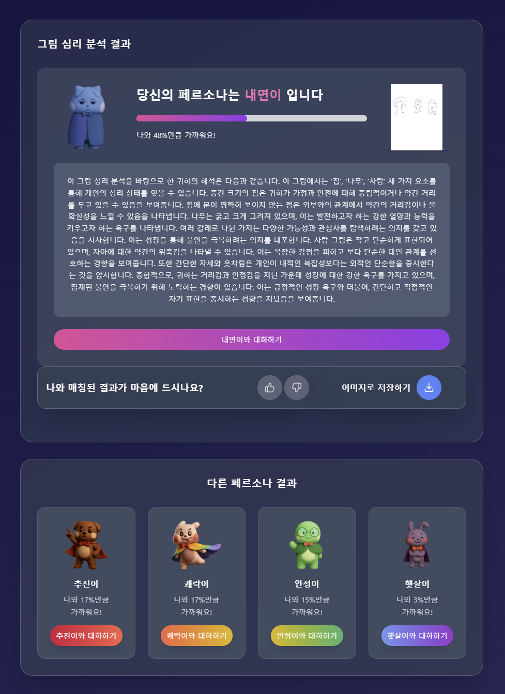
    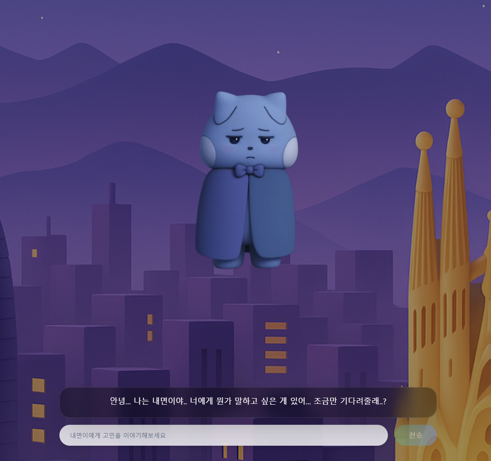
    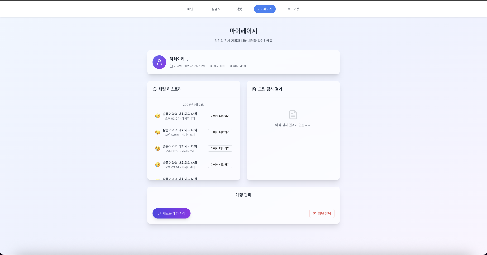
  </p>


  ## AWS EC2 배포
  ### **🌐 배포된 서비스**
  - **웹 애플리케이션**: http://ec2-3-34-245-132.ap-northeast-2.compute.amazonaws.com
  <p align="center">
    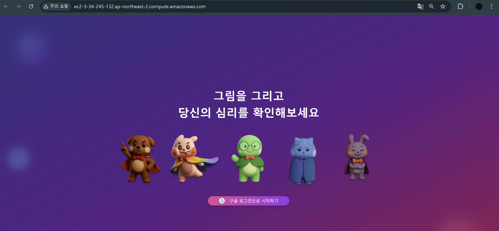
  </p>


  ### 🔄 배포 프로세스

  #### 1. 서버 준비
  ```bash
  # EC2 인스턴스에 Docker 설치
  sudo apt update
  sudo apt install docker.io docker-compose
  sudo usermod -aG docker $USER
  ```

  #### 2. 프로젝트 배포
  ```bash
  # 저장소 클론
  git clone https://github.com/your-org/SKN12-FINAL-6TEAM.git
  cd SKN12-FINAL-6TEAM

  # 환경 변수 설정
  cp backend/.env.example backend/.env
  cp frontend/.env.example frontend/.env

  # 프로덕션 빌드 및 실행
  docker-compose up -d --build
  ```

  #### 3. 서비스 확인
  ```bash
  # 컨테이너 상태 확인
  docker-compose ps

  # 로그 확인
  docker-compose logs -f backend
  docker-compose logs -f frontend
  ```

  ### 🔍 배포 모니터링

  #### 서비스 상태 확인
  ```bash
  # 컨테이너 리소스 사용량
  docker stats

  # 실시간 로그 모니터링
  docker-compose logs -f --tail=100
  ```

  ## 📞 문의 및 지원

  - **프로젝트 관리자**: 이정민 (jeongmin0507@naver.com)
  - **배포 문의**: 김승학 (seunghak.dev@gmail.com)
  - **기술 문의**: 남의헌 (listener0219@gmail.com)
  - **모델 문의**: 이지복 (jibok815@gmail.com)
  - **UI/UX 문의**: 조성지 (joseongji@naver.com)

  ---

  <br>
  <br>

  # 📜우리의 마지막 회고록
  |이름|내용|
  |--|--|
  | 김승학 |  PL으로서 역할을 수행하며 단순히 기술적 리더가 아니라, 팀의 분위기를 조율하고 개개인의 잠재력을 이끌수 있도록 하는 조력자 역할 라는 것을 이번 프로젝트 때 깊이 체감하였습니다. 부족한 점도 있었지만, 팀원들의 적극적인 협력과 열정 덕분에 높은 완성도의 결과물을 함께 만들 수 있었습니다.   |
  | 남의헌 |  직접 큰 프로젝트를 진행하면서 데이터 관련 부분을 맡아 수업을 들으며 이해하지 못했던 것들도 직접 경험해보며 제 것으로 가져갈 수 있었고, 서비스 배포까지의 과정을 통해 전반적인 프로젝트의 흐름을 파악하고, 팀원 간의 소통과 화합의 중요성을 다시 한번 깨닫게 되었습니다. 그리고 순탄한 프로젝트 마무리를 위해 배려해 준 팀원들에게 감사드립니다. |
  | 이정민 | PM으로서의 경험이 부족했음에도 불구하고, 팀원들의 적극적인 참여와 노력 덕분에 높은 품질의 웹서비스를 완성할 수 있었습니다. 총괄 역할을 수행하며 개별 기능의 세부 구현보다는 기획부터 배포까지의 전체적인 프로세스와 시스템 구조를 이해하는 데 집중할 수 있었던 뜻깊은 프로젝트였습니다.   |
  | 이지복 | 추웠던 2월부터 한여름 지금까지 이 마지막 프로젝트를 위해 달려왔는데 그 끝에서 가장 최고의 팀원들과 결실을 함께 볼 수 있어서 정말 뿌듯합니다. 다양한 LLM 모델을 다루고 다양한 접근법을 고민하면서 어떻게 성능을 개선할지 고찰을 할 수 있는 시간을 가졌습니다. 또한, 모델링 뿐 아니라 그동안 배웠던 내용을 마지막 프로젝트에 녹여내기 위해 많은 노력을 했고 부족한 점은 팀원들 도움으로 해결하면서 협업의 중요성도 깨닫는 시간을 가질 수 있었던 것 같습니다. 다들 정말 고생 많았고 감사합니다.  |
  | 조성지 | 개발 관련 지식이 부족했음에도 불구하고 팀원들이 잘 이끌어주어서 정말 많이 배울 수 있었던 프로젝트였습니다. 이번에는 프론트엔드 위주로 기여했지만, 이번 프로젝트에서의 배움을 바탕으로 더 다양한 분야에 도전해볼 예정입니다. (그리고 이 서비스 사업화 할거에요 많관부) |

  ## 🙏 감사의 말

  이 프로젝트는 **SKT AI Family AI Camp 12기** 과정에서 개발되었습니다.


  <div align="center">

  **마이무디와 함께 마음의 평안을 찾아보세요**


  </div>