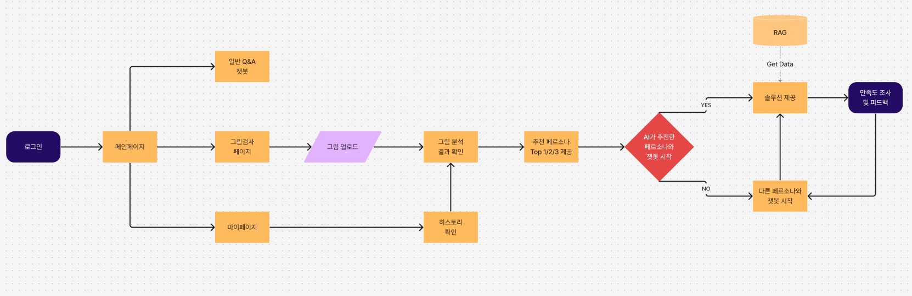

# 🐢 거북이상담소: HTP 기반 그림 심리 분석 & GPT 페르소나 챗봇 플랫폼

## 👨‍👨‍👧‍👦 팀 소개

|                       **김승학**                        |                      **남의헌**                      |                       **이정민**                       |                     **이지복**                      |                      **조성지**                       |
| :-----------------------------------------------------: | :--------------------------------------------------: | :----------------------------------------------------: | :-------------------------------------------------: | :---------------------------------------------------: |
|  |  |  |  |  |

---


## 📌 프로젝트 개요

**HTP(House-Tree-Person) 기반 심리 분석과 AI 챗봇을 결합한 비대면 정서 지원 서비스**

- 사용자가 직접 그린 집-나무-사람 그림을 분석하여 정서 상태 및 심리 유형을 추론
- 감정 키워드 기반으로 5가지 성격 유형 분류 (내면형 / 안정형 / 관계형 / 추진형 / 쾌락형)
- 유형별 맞춤형 페르소나 챗봇 연결 → 정서적 공감 및 셀프케어 전략 제공

> 📊 정량적 분석 + GPT 기반 해석 + ML 분류 + 유형별 프롬프트 → 개인 맞춤형 상담 경험 제공

---

## 🧠 핵심 기능

### 1. 이미지 업로드 → 심리 분석

- YOLOv11로 집/나무/사람 객체 탐지
- OpenCV로 시각적 요소 수치화 (크기, 위치, 비율 등)
- GPT-4o가 그림 의미 해석 문장 생성 (프롬프트 기반 엔지니어링)

### 2. 감정 키워드 추출 & 유형 분류

- 해석문에서 감정 키워드 파싱 → JSON 매핑 테이블로 점수화
- KoBERT 기반 분류기로 5가지 유형 중 하나 분류

### 3. 페르소나 챗봇 연결

- 유형별 프롬프트 기반 GPT-4o 챗봇 연결
- 정서 피드백, 공감 대화, 자기 돌봄 전략 제공

---

## 📁 폴더 구조 (수정 예정)

```
SKN12-FINAL-6TEAM/
├── README.md
├── requirements.txt
│
├── backend/
│   ├── app/                     # FastAPI 앱: 라우터, 모델, 서비스, DB 설정
│   ├── llm/                     # GPT 분석, KoBERT/YOLO 모델, RAG 문서
│   ├── data/                    # 키워드 데이터셋
│   ├── preprocess/              # 전처리 스크립트 및 결과
│   ├── prompts/                 # 유형별 챗봇 프롬프트
│   ├── tests/                   # 테스트 코드
│   └── requirements.txt
│
├── frontend/
│   ├── public/                  # 정적 파일 및 이미지
│   ├── src/
│   │   ├── components/          # 페이지 및 공통 컴포넌트
│   │   ├── services/            # API 서비스 로직
│   │   ├── hooks/               # 커스텀 훅
│   │   ├── types/               # 타입 정의
│   │   └── data/                # 정적 데이터
│   ├── package.json
│   └── tailwind.config.js
```

## 주요 디렉토리 설명

### Backend

- **`app/`**: FastAPI 메인 애플리케이션 코드
- **`llm/`**: AI/ML 모델 관련 코드 및 데이터
- **`data/`**: 학습용 데이터셋
- **`preprocess/`**: 데이터 전처리 스크립트
- **`tests/`**: 백엔드 테스트 코드

### Frontend

- **`src/components/pages/`**: 각 페이지별 React 컴포넌트
- **`src/components/common/`**: 재사용 가능한 공통 컴포넌트
- **`src/services/`**: API 통신 및 외부 서비스 연동
- **`src/hooks/`**: 커스텀 React 훅
- **`src/types/`**: TypeScript 타입 정의

### AI/ML

- **`llm/model/`**: 머신러닝 모델 훈련 및 추론 코드
- **`llm/rag/`**: RAG 시스템용 문서 및 이미지
- **`llm/detection_results/`**: 그림 분석 결과 저장소

---

## 🛠 기술 스택

| **구분**           | **기술 스택**                                                                                                                                                                                                                                                                                                                      |
| ------------------ | ---------------------------------------------------------------------------------------------------------------------------------------------------------------------------------------------------------------------------------------------------------------------------------------------------------------------------------- |
| **Backend**        |                          |
| **Frontend**       |                                                                                                                 |
| **AI 모델**        |     |
| **Infra & DevOps** |              |

---

## 🧬 모델 구성 및 성능

| 모델    | 목적                        | 정확도/성능                     |
| ------- | --------------------------- | ------------------------------- |
| YOLOv11 | 집-나무-사람 객체 탐지      | Precision: 0.99 / Recall: 0.97  |
| KoBERT  | 감정 키워드 → 성격유형 분류 | Accuracy: 0.97 / F1 Score: 0.96 |

> 🧠 모델은 PyTorch 기반으로 개발되었으며, `.pt` 형식으로 저장 및 추론 가능

---

## 🧠 상담 유형별 챗봇 전략

| 유형   | 주요 특성               | 챗봇 상담 전략                   |
| ------ | ----------------------- | -------------------------------- |
| 내면형 | 감정적 민감함, 자기성찰 | 감정 표현 유도, 자기 이해 촉진   |
| 안정형 | 조화 지향, 불안 회피    | 신뢰 중심 언어, 정서적 안정 제공 |
| 관계형 | 애정 중심, 인정 욕구    | 정서 유대 형성, 자기 돌봄 강조   |
| 추진형 | 성취욕, 통제욕          | 목표 중심, 자기 주도성 강화      |
| 쾌락형 | 자극 추구, 고통 회피    | 긍정 감정 환기, 창의적 자극 제공 |

---

## 🗃 데이터베이스 ERD

<p align="center">
  
</p>

## ⚙️ 시스템 아키텍처

<p align="center">
  
</p>

## 🖥️ 유저플로우

<p align="center">
  
</p>

## 🗓️ 프로토타입

<p align="center">
  
  <br>
  
  
</p>
